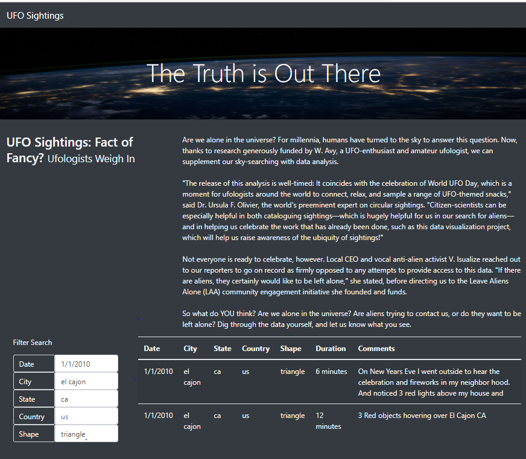

# UFOs
## Project Overview
Dana would like to provide a more in-depth analysis of UFO sightings by allowing users to filter for multiple criteria at the same time. 
She would also like to add table filters for the city, state, country, and shape.

## Purpose: - 
To filter UFO sightings on multiple criteria. 
To filter a table using JavaScript and HTML. 

## Materials: - 
JavaScript, HTML, CSS, and D3.js

## Results: - 
Based on search criteria the code allowed the user to filter the table for specific values (please find the table at the very end). 

## Deliverable 1: Filter UFO sightings on multiple criteria 
Multiple search criteria for users:- 
Type the date into date field
Choose city, state, country, and shape at the same time in lower case.  
No space at the end of the text 
Finally click enter 

## Drawbacks:
The data don’t have all dates for the months of January. Therefore, the user must know the specific dates, also specific cities, and shapes. 
The webpage doesn’t allow space at the end of the text 
The webpage filters only accept in lower case 

## Recommendations: 
Allow the users to use both upper- and lower-case spellings 
The webpage should accept space at the end of the text to avoid any error or no filter issue if the user insert space accidentally.  

	Below is the result based on multiple filed search: - 
